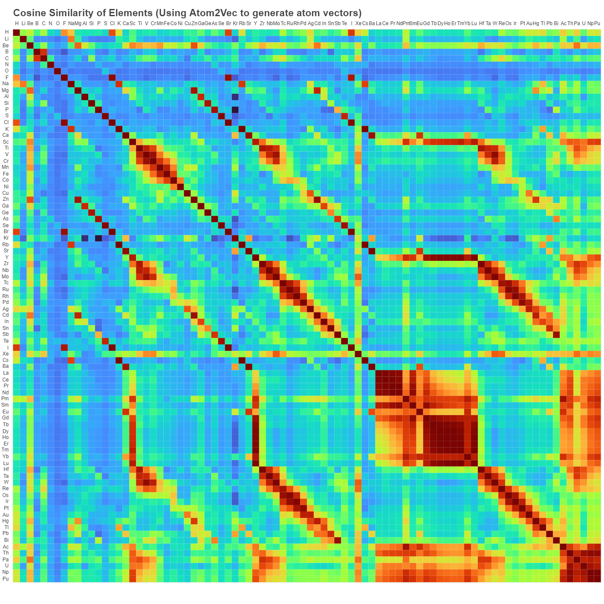

# Atom2Vec
A python implement of Atom2Vec: a simple way to describe atoms for machine learning

(*Updated 06/21/2021*: We refactored the code with `pymatgen`, you can find old version in branch `old_version`. Now the code is fully typed and tested.)
## Background
Atom2Vec is first proposed on [Zhou Q, Tang P, Liu S, et al. Learning atoms for materials discovery[J]. Proceedings of the National Academy of Sciences, 2018, 115(28): E6411-E6417.](https://www.pnas.org/content/115/28/E6411#page)

## Demo
[](https://old.yuxingfei.com/src/similarity.html)

## Installation
```shell
pip install atom2vec
```

## Usage
### Generating atom vectors and atom similarity matrix
We use `pymatgen.core.Structure` to store all the structures. 
```python
from atom2vec import AtomSimilarity
from pymatgen.core import Structure
from typing import List

structures: List[Structure]
atom_similarity = AtomSimilarity.from_structures(structures, 
                                                 k_dim=100, max_elements=3)
```

### Query atom vectors
```python
from atom2vec import AtomSimilarity
from pymatgen.core import Element
from typing import List

atom_similarity: AtomSimilarity
atom_vector: List[float]

atom_vector = atom_similarity.get_atom_vector(1)  # atomic index
atom_vector = atom_similarity.get_atom_vector("H")  # atom's name
atom_vector = atom_similarity.get_atom_vector(Element("H"))  # pymatgen Element Enum
```

### Query atom similarity
```python
from atom2vec import AtomSimilarity
from pymatgen.core import Element

atom_similarity: AtomSimilarity
similarity: float

similarity = atom_similarity["Ca", "Sr"]
```
